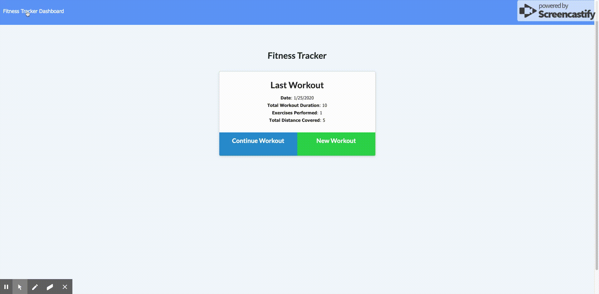

# Workout-Tracker

## Description

Imagining how awesome it would be if having a handy workout tracker application, so you can keep track of what you have done and how much you are still away from your goal. In this project, I have built a fitness/workout tracker application with below features.

Here is how the application made of:
* UI: **HTML** & **CSS**
* Database: **MONGO** & **MONGOOSE SCHEMA**
* Backend: **Node**, **Express** , **MANIFEST** & **SERVICE WORKER**

### Demo
Heroku Depolyment: [GO](https://norman-workout-tracker.herokuapp.com/)

wa
## Development

In the process of building application, I have learned:
* Utilize Github repository, familiarize git commands to save all my works onto github

* Familiarize the basic html commands to build the full contents of the site

* Utilize manifest feature to make it compatitible for mobile

* Utilize service worker as cach to make the application working even when it is offline

## Credits 

I am here to acknowlage to the Coding Bootcamp of University of Washington along with below falcuties:
* Jason Rosen (Instructor)
* Daniel Mont-Eton (TA)
* Elisabeth (TA)

## License
MIT License

Copyright (c) [2019] [Norman Lei]

Permission is hereby granted, free of charge, to any person obtaining a copy
of this software and associated documentation files (the "Software"), to deal
in the Software without restriction, including without limitation the rights
to use, copy, modify, merge, publish, distribute, sublicense, and/or sell
copies of the Software, and to permit persons to whom the Software is
furnished to do so, subject to the following conditions:

The above copyright notice and this permission notice shall be included in all
copies or substantial portions of the Software.

THE SOFTWARE IS PROVIDED "AS IS", WITHOUT WARRANTY OF ANY KIND, EXPRESS OR
IMPLIED, INCLUDING BUT NOT LIMITED TO THE WARRANTIES OF MERCHANTABILITY,
FITNESS FOR A PARTICULAR PURPOSE AND NONINFRINGEMENT. IN NO EVENT SHALL THE
AUTHORS OR COPYRIGHT HOLDERS BE LIABLE FOR ANY CLAIM, DAMAGES OR OTHER
LIABILITY, WHETHER IN AN ACTION OF CONTRACT, TORT OR OTHERWISE, ARISING FROM,
OUT OF OR IN CONNECTION WITH THE SOFTWARE OR THE USE OR OTHER DEALINGS IN THE
SOFTWARE.

Ajax Autocomplete for jQuery is freely distributable under the terms of an MIT-style license.
Copyright notice and permission notice shall be included in all copies or substantial portions of the Software.
